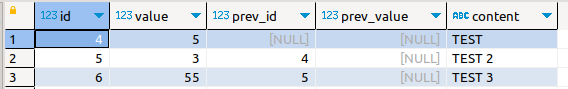
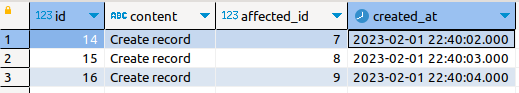
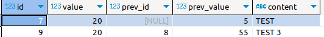

## Триггеры mysql
Триггеры это определенные процедуры которые выполняются до/после
определенного действия с записями в таблице.
Например, после добавления записи, перед редактирование, после удаления


Пример кода создания триггера
```mysql
drop trigger if exists trg_test_after_insert;
DELIMITER $$
create trigger trg_test_after_insert after insert on database_name.table_name  
for each row 
BEGIN 
	update table_name SET field = 0 WHERE id = new.id;
END$$
DELIMITER ;
```

Разберем данный пример построчно
- ``drop trigger if exists trg_test_after_insert;`` - удаления триггера если он существует
- ``DELIMITER $$`` - переопределение разделителя, для использования ; внутри кода триггера
- ``create trigger trg_test_after_insert after insert on database_name.table_name`` - создание триггера который будет срабатывать **после добавления** новой записи в таблицу table_name базы данных database
- ``for each row `` - срабатывать для каждой записи
- ``update table_name SET field = 0 WHERE id = new.id`` - тело триггера, действия осуществляемые при срабатывании, это может быть обновление текущей записи (добавление значений) или изменение любой другой таблицы
- ``END$$`` - конец тела триггера
- ``DELIMITER ;`` - возврат разделителя по умолчанию

Для обращения к строке к которой относится совершенное действие используются ключевые слова **NEW**, **OLD**.

``NEW.<field_name>`` - обращение к полю задействованной строки после её изменения (Доступна при вставке и редактировании).
``OLD.<field_name>`` - обращение к полю задействованной строки до изменения
### Пример работы триггеров
Создание тестовых таблиц
```mysql
DROP TABLE IF EXISTS test;
CREATE TABLE test(
	id SERIAL PRIMARY KEY,
	value INT DEFAULT 0,
	prev_id BIGINT UNSIGNED NULL,
	prev_value INT NULL,
	content TEXT NULL
);

DROP TABLE IF EXISTS log;
CREATE TABLE log(
	id SERIAL PRIMARY KEY,
	content TEXT NOT NULL,
	affected_id BIGINT UNSIGNED NOT NULL,
	created_at DATETIME DEFAULT NOW()
);
```
Создание триггеров
```mysql
drop trigger if exists trg_test_after_insert;
drop trigger if exists trg_test_after_update;
drop trigger if exists trg_test_after_delete;
drop trigger if exists trg_test_before_insert;
drop trigger if exists trg_test_before_update;

DELIMITER $$
-- Создание записей в логе при добавление/редактировании/удалении записей в таблице test
create trigger trg_test_after_insert AFTER INSERT ON test
for each row
BEGIN 
	INSERT INTO log(content, affected_id) VALUES('Create record', NEW.id);
END$$
create trigger trg_test_after_update AFTER UPDATE ON test
for each row
BEGIN 
	INSERT INTO log(content, affected_id) VALUES('UPDATE record', NEW.id);
END$$
create trigger trg_test_after_delete AFTER DELETE ON test
for each row
BEGIN 
	INSERT INTO log(content, affected_id) VALUES('DELETE record', OLD.id);
END$$

-- Добавление значения prev_id таблицы test
create trigger trg_test_before_insert BEFORE INSERT ON test
FOR EACH ROW 
BEGIN 
	SET new.prev_id = (SELECT MAX(id) FROM test);
END$$
-- Добавление значения prev_value таблицы test
create trigger trg_test_before_update BEFORE UPDATE ON test
FOR EACH ROW 
BEGIN 
	SET new.prev_value = old.value;
END$$
DELIMITER ;

```
Триггеры trg_test_after_insert, trg_test_after_update, trg_test_after_delete добавляют в табилцу лог записи с информацие о совершенных действиях в таблице test<br>

trg_test_before_insert - Присваивает полю prev_id идентификатор предыдущей записи добавленной в таблицу test 

trg_test_before_update - Присваивает поля prev_value предыдущее значение поля value

```mysql
INSERT INTO test(value, content) VALUES(5, 'TEST');
INSERT INTO test(value, content) VALUES(3, 'TEST 2');
INSERT INTO test(value, content) VALUES(55, 'TEST 3');
SELECT * FROM test;
```

```mysql
SELECT * FROM log;
```

```mysql
DELETE FROM test where value = 3;
SELECT * FROM log;
UPDATE test SET value = 20;
SELECT * FROM test;
```
