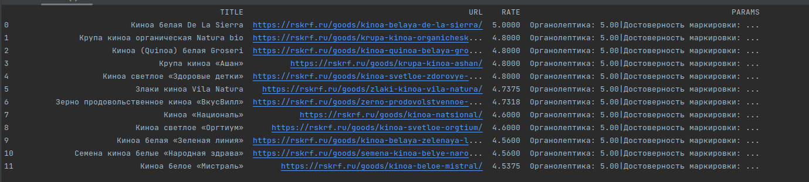

## Урок 3. Парсинг данных. HTML, Beautiful Soap
#### Вариант 2
Необходимо собрать информацию по продуктам питания с сайта: Список протестированных продуктов на сайте [Роскачество](https://rskrf.ru/ratings/produkty-pitaniya/)
Приложение должно анализировать несколько страниц сайта (вводим через input или аргументы).

Получившийся список должен содержать:

* Наименование продукта.
* Все параметры (Безопасность, Натуральность, Пищевая ценность, Качество) Не забываем преобразовать к цифрам
* Общую оценку
* Сайт, откуда получена информация.

Общий результат можно вывести с помощью dataFrame через Pandas. Сохраните в json либо csv.

---
#### Запуск:
`python main.py`
#### Результат:
