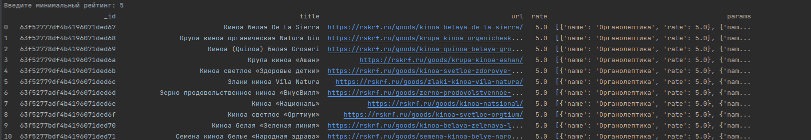
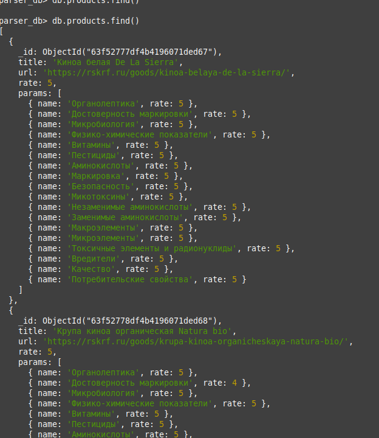

## Урок 4. Система управления базами данных MongoDB в Python

1. Развернуть у себя на компьютере/виртуальной машине/хостинге MongoDB и реализовать функцию, которая будет добавлять только новые вакансии/продукты в вашу базу.
2. Написать функцию, которая производит поиск и выводит на экран вакансии с заработной платой больше введённой суммы (необходимо анализировать оба поля зарплаты). Для тех, кто выполнил задание с Росконтролем - напишите запрос для поиска продуктов с рейтингом не ниже введенного или качеством не ниже введенного (то есть цифра вводится одна, а запрос проверяет оба поля).
---

### Структура
- main.py - мэин скрипт
- scrapper.py - Классы и скрипт для запуска парсера

### Классы
- ParserStorage - Класс реализующий хранилище продуктов в MongoDB, а так же поиск
- BsParser - Базовый класс парсера,вспомогательные методы
- SiteParser - Класс парсера сайта, реализует обход страниц по введённым настройкам
- ProductParserProvider - Класс парсера для реализации сбора информации о товаре

### Запуск
`python scrapper.py` - запуск сбора данных с сайта rskrf.ru и сохрание их в БД

`python main.py` - Поиск и вывод на экран 
### Скриншоты

