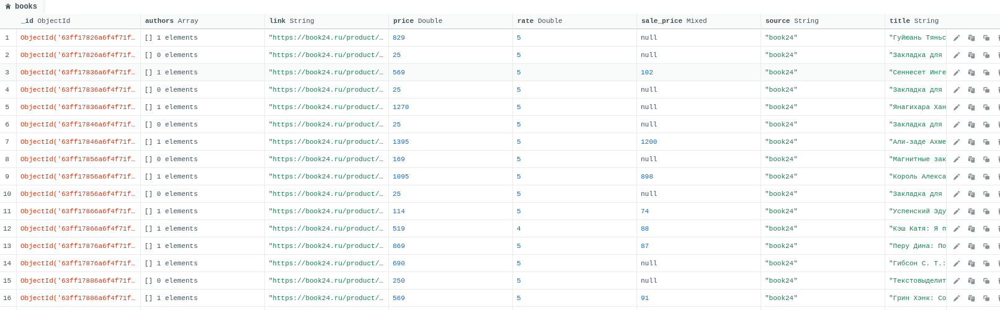

## Урок 6. Фреймворк Scrapy, pipelines, Splash
### II вариант
1) Создать пауков по сбору данных о книгах с сайтов labirint.ru и/или book24.ru
2) Каждый паук должен собирать:
   * Ссылку на книгу
   * Наименование книги
   * Автор(ы)
   * Основную цену
   * Цену со скидкой
   * Рейтинг книги
3) Собранная информация должна складываться в базу данных

---

### Структура
- main.py - мэин скрипт
- scrapy.cfg
- bookcrawler - дирректория с проектом scrapy

### Запуск
`python main.py labirint` - Запуск парсинга с сайта labirint.ru 
`python main.py book24` - Запуск парсинга с сайта book24.ru 
Или можно воспользоваться методами scrapy 
`scrapy crawl book24` 
`scrapy crawl labirint`

### Скриншот
